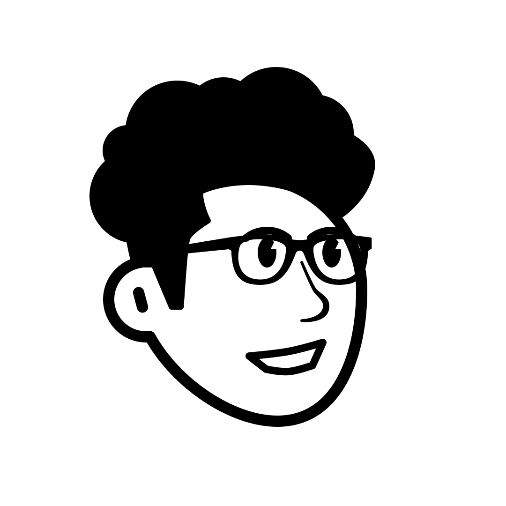

<header class="py-5 bg-light mb-5">
    

        <h1 class="display-3 fw-bold mb-4 serif">The Story Behind My Blog</h1>
    

</header>

<section class="container mb-5 pb-5">
    

        

            

                
                

                    <h2 class="fw-bold mb-1">Tamilarasu Arunachalam</h2>
                    
Software Engineer & Blogger

                

            

            

                
I am Tamilarasu. I am a Software Engineer. I have been a developer for over 5 years and have been a tech enthusiast for as long as I can remember. I am passionate about building tools that help people be more productive and happy.

                
On this blog, I share my own development learnings, honest insights, and the technical breakdown of the tools I build. My goal is simple: to help you make informed decisions about the technology you invite into your workspace.

                <h3 class="mt-5 mb-4 fw-bold">Let's Connect</h3>
                
I'm always open to discussing new ideas. Feel free to reach out via my <a href="/contact">contact page</a> or follow me on <a href="https://www.linkedin.com/in/tamilarasu-arunachalam">LinkedIn</a>.

            

        

    

</section>
